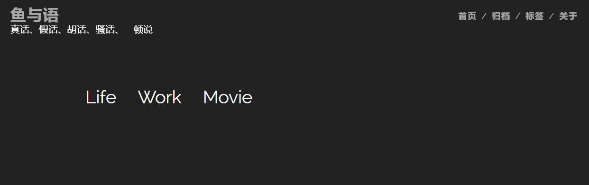

#  Gridea Theme 「 NederburgNew 」

套用[Nederburg](https://github.com/Suremotoo/gridea-theme-nederburg)主题，在此基础上，进行个人喜好的微调

感谢原作者@[Suremotoo](https://github.com/Suremotoo)

## 修改

- **增加文章目录导航(右下角)**

  ​	感谢作者@[yaohaixiao](https://github.com/yaohaixiao)提供的插件[autojs](https://github.com/yaohaixiao/autocjs)

- 删除顶部菜单栏

- 删除多余的文件

- 增加代码块css样式

- 样式风格个人喜好魔改

- 文章正文过滤摘要 (个人喜好)

## 展示 ##




## 安装
1. 如果Gridea正在运行，请先关闭.
2. 进入 **<你的Gridea主题文件夹>** 然后执行 ``` git clone https://github.com/sadjjk/gridea-theme-nederburgNew.git ```
3. 重新启动Gridea，在「主题」菜单中选择 「nederburgNew」，点击保存！

